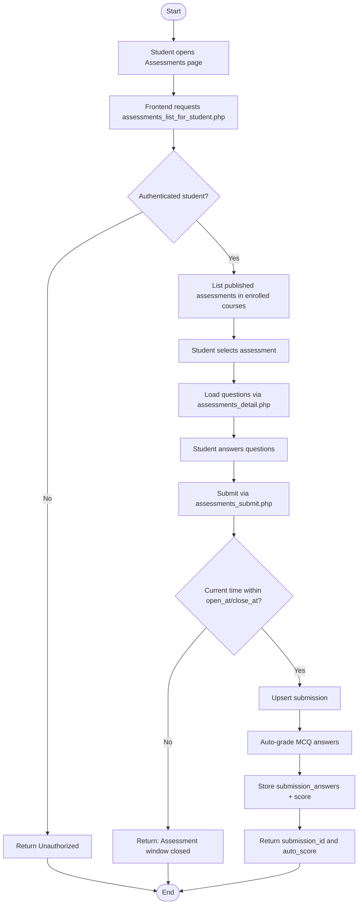
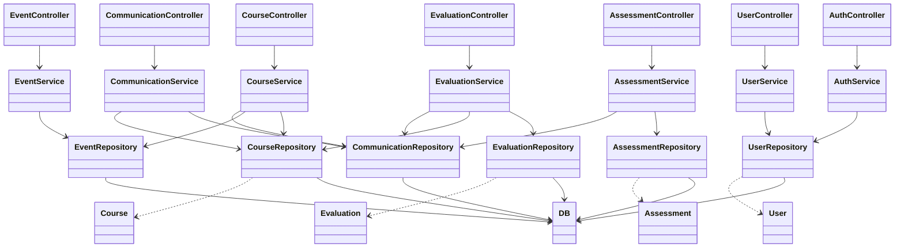
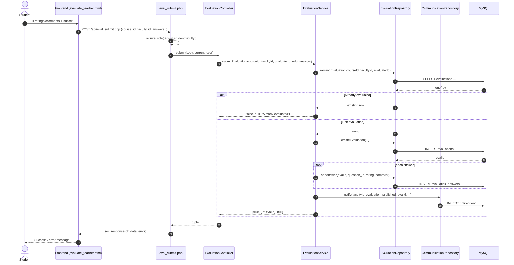

# LMS Project UML Diagrams

## 1) Use Case Diagram

```mermaid
flowchart LR
    Student([Student])
    Faculty([Faculty])
    Admin([Admin])

    subgraph LMS[Learning Management System]
      UC1((Register / Login))
      UC2((Manage Profile))
      UC3((Browse Courses))
      UC4((Enroll / Unenroll Course))
      UC5((View Course Dashboard))
      UC6((Take Assessment))
      UC7((Grade Submissions))
      UC8((View Transcript & Certificate))
      UC9((Submit Teacher Evaluation))
      UC10((View Faculty Ratings))
      UC11((Manage Eval Questions))
      UC12((Send/Read Messages))
      UC13((View Notifications))
      UC14((Create Events))
      UC15((Post Announcements))
      UC16((Manage Users & Roles))
      UC17((View Admin Reports))
    end

    Student --> UC1
    Student --> UC2
    Student --> UC3
    Student --> UC4
    Student --> UC5
    Student --> UC6
    Student --> UC8
    Student --> UC9
    Student --> UC12
    Student --> UC13

    Faculty --> UC1
    Faculty --> UC2
    Faculty --> UC5
    Faculty --> UC7
    Faculty --> UC10
    Faculty --> UC12
    Faculty --> UC13
    Faculty --> UC14
    Faculty --> UC15

    Admin --> UC1
    Admin --> UC11
    Admin --> UC16
    Admin --> UC17
    Admin --> UC9
```

## 2) Data Flow Diagram

```mermaid
flowchart LR
    U[Users: Student/Faculty/Admin]
    FE[Frontend Pages + app.js]
    API["PHP API Endpoints (/src/api)"]
    C[Controllers]
    S[Services]
    R[Repositories]
    DB[(MySQL lms DB)]

    U -->|HTTP + Session Cookie| FE
    FE -->|"fetch /api/*.php JSON"| API
    API -->|"body(), require_login(), require_role()"| C
    C -->|delegate business operations| S
    S -->|read/write queries| R
    R --> DB
    DB --> R
    R --> S
    S -->|"ok, data, error tuple"| C
    C --> API
    API -->|json_response| FE
    FE --> U

    S -->|notification events| R
```

## 3) Activity Diagram (Student Takes Assessment)

## 4) Class Diagram (Architecture)

## 5) Sequence Diagram (Submit Teacher Evaluation)

